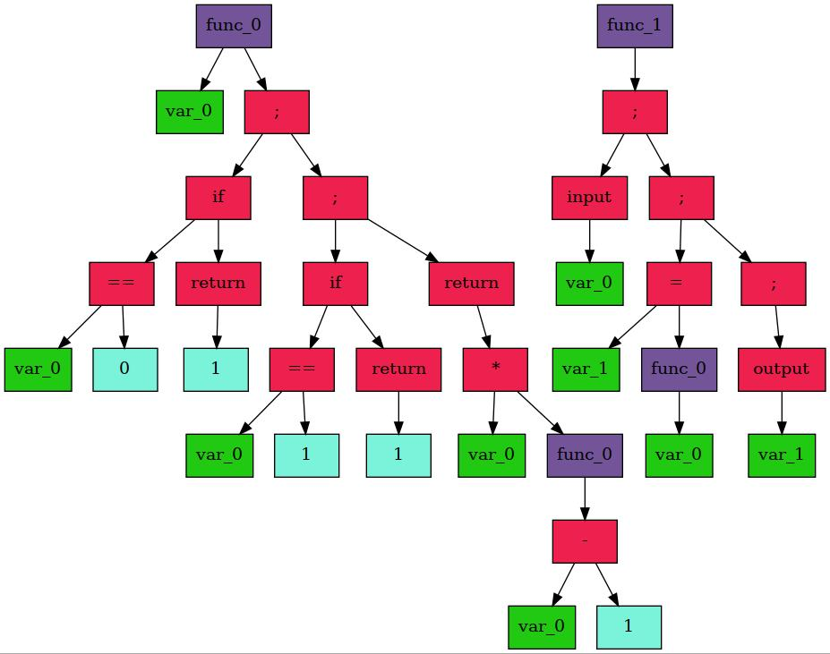

# Компилятор

### Предисловие

Этот проект является продолжением моего прошлого [проекта](https://github.com/ask0later/language.git).

Текстовый файл с кодом на моём языке программирование преобразовывался в `AST-дерево`, а затем в инструкции `ассемблера`, написанного мной ранее, и исполнялся на эмуляторе [процессора](https://github.com/ask0later/Processor.git).

Сейчас же мы избавимся от своего процессора, и на выходе будем генерировать исполняемую программу стандартного формата.

### Запуск программы
В директории `examples` находятся файлы с расширением `.txt`, которые написаны на моем языке. Вы можете написать свою программу и получить на выходе ELF-файл. Для этого запустите скрипт cmpl.sh `<имя файла>`, а затем `./<имя файла>`.


## Проект делится на три части:

1. Код программы сгенерировать в стандратное бинарное `AST-дерево` (Abstract Syntax Tree).  
2. Из формата `AST-дерева` перейти к собственному формату `IR` (Intermediate Representation).
3. Из IR-формата перейти к исполняемому рабочему ELF-файлу (Executable and Linkable Format).

# Лексика и синтаксис языка

Пример кода программы, которая считает факториал числа:

```
handing over to you |..-. .- -.-. -| (|-.|)
{
    reseption if (|-.| match |-----|)
    {
        out |.----|;
    };

    reseption if (|-.| match |.----|)
    {
        out |.----|;
    };

    out |-.| * |..-. .- -.-. -| (|-.| - |.----|) ;
}

handing over to you |-- .- .. -. | ()
{
    give a signal (|-.|);
    
    |..-.| encoding matches |..-. .- -.-. -| (|-.|);

    get the message (|..-.|) ;
}
```

## Формат языка

Формат сиснтаксиса похож на язык Си. В язык добавлены локальные переменные типа `int`, функции, условия и циклы, а также функции ввода и вывода числа. 

Функция `MAIN` является последней определенной и именно с нее начнется выполнения программы.

## Представление чисел и переменнных
Переменные представлены в виде строки из зашифрованных букв и чисел на азбуке Морзе. Числа зашифрованы также. Вот пример некоторых букв и цифр:

~~~
A - ".-"        B - "-..."      C - "-.-."

0 - "-----"     1 - ".----"     2 - "..---"
~~~

Тогда к примеру функция `MAIN` имеет такую кодировку: `"-- .- .. -."`.

## Лексика

### Ключевые слова
1. handing over to you - определение функции.
2. out - выход из функции и возвращение значения.
3. encoding matches - присваивание значения к переменной.
4. reseption while - начало объявления цикла.
5. reseption if - начало объявления условия.
6. give a signal - функция ввода числа.
7. get the message - функция вывода числа.
8. overflow - знак сравнения больше.
9. lacking - знак сравнения меньше.
10. match - знак равенства.
11. diverse - знак неравенства.

### Операторы
1. +, -, *, \ - математические операторы.
2. ==, !=, >, < - операторы сравнения.
3. if, while - операторы условия.
4. = - оператор присваивания.

### Стандартные функции
1. input - функция ввода числа.
2. output - функция вывода числа.

## Синтаксис

После каждого оператора и его аргументов всегда ставится `;`.

Математические выражения подчиняются стандартному порядку выполнения действий.

Прежде чем компилятор начнет парсить программу, каждому оператору, функции, переменной и числу создаст свой токен, в котором указан его тип, значение и дополнительные данные.

Далее рекурсивным спуском создается бинарное дерево, которое выглядит так: 

</p>

Глядя на дерево, интуитивно понятно, что просиходит в программе при выполнении.

# Формат Intermediate Representation

Промежуточное представление позволяет оптимизировать код, не зная с каким конкретно `AST-деревом` он работает. В нашем случае он будет удобным в плане генерирования исходной программы в виде ассемблерного файла и `ELF-файла`.

Блоки IR - последовательность из стркутур, каждая из которых соответсвует одной команде ассемблера. Она имеет свой тип (`IR_MOV`, `IR_PUSH` и т.д.) и два аргумента с типами и значениями (`REG_ARG`, `MEM_ARG`, и т.д.). 

В процессе определения блока IR, в его поле записывается также набор инструкций для `x86-64` архитектуры (`опкоды`).

На выходе один блок IR инструкции выглядит так:

________________________________________________________________________________________
| Тип инструкции | Тип $1^{го}$ | Значение $1^{го}$ | Тип $2^{го}$ | Значение $2^{го}$ | Опкод             |
| ------         | :----------: | :---------------: | :----------: | :---------------: | :---------------: | 
| **MOV**            |   **REGISTER**   |        **rax**        |    **REGISTER**  |         **r11**       |  **0x4c 0x89 0xd8**   |
________________________________________________________________________________________


Из IR-блоков мы уже можем сгенерирвать ассемблерный файл. Для создания рабочего исполняемого ELF-файла необходимо разобраться с его структурой.

# Структура ELF-файла

ELF-файл содержит 3 заголовка – `ELF File Header`, `Program Header`, и `Section Header`.

Заголовок `ELF-файла` содержит сигнатуру, тип файла, информацию о `Program Header` и `Section Header` (размер, адрес и т.д.) и другое.

`Program Header` содержит
информацию о сегментах.
Сегменты – это регионы памяти, которые содержат некоторое количество секций.

`Section Header` содержит информацию про секции и множество служебных секций. Он необходим для линковки объектных файлов, поэтому в нашей работе достаточно будет обойтись без него.

</p>

Источник: https://ru.wikipedia.org/wiki/Executable_and_Linkable_Format

После заголовков в файле идут сегменты, в нашем случае `text` и `data`.

Разберемся со структурой заголовков.

**ELF File Header**
______________________________________________________________________
| Поле структуры  | Его значение                                      |
| ------          | ----------:                                       |
| **e_ident**     | Магическое число, информация о архитектуре и т.д. |
| **e_type**      | Тип объектного файла                              |
| **e_machine**   | Архитектура                                       |
| **e_version**   | Версия объектного файла                           |
| **e_entry**     | Виртуальный адрес точки входа                     |
| **e_phoff**     | Смещение таблицы заголовков программы в файле     |
| **e_shoff**     | Смещение таблицы заголовков секций в файле        |
| **e_flags**     | Флаги, зависящие от процессора                    |
| **e_ehsize**    | Размер заголовка ELF в байтах                     |
| **e_phentsize** | Размер записи таблицы заголовков программы        |
| **e_phnum**     | Количество записей в таблице заголовков программы |
| **e_shentsize** | Размер записи таблицы заголовков секций           |
| **e_shnum**     | Количество записей в таблице заголовков секций    |
| **e_shstrndx**  | Индекс таблицы строк в заголовке секции           |
_______________________________________________________________________

Разместим функцию `MAIN` в начале сегмента `text`, тогда точка входа будет равнятся адресу начала этого сегмента.

Программный заголовок для сегмента `text` и `data` имеет поля:


**Program Header**
______________________________________________________________
| Поле структуры | Его значение                               |
| :------        | ----------:                                |
| **p_type**     | Тип сегмента                               |
| **p_flags**    | Флаги сегмента                             |
| **p_offset**   | Смещение от начала файла                   |
| **p_vaddr**    | Виртуальный адрес сегмента                 |
| **p_paddr**    | Физический адрес сегмента                  |
| **p_filesz**   | Количество байтов в образе файла сегмента  |
| **p_memsz**    | Количество байтов в памати образа сегмента |
| **p_align**    | Выравнивание                               |
______________________________________________________________


Все заголовки находятся в одном сегменте, который имеет размер кратный значению выравнивания.

Смещение `text` относительно начала файла равняется значению выравнивания, `data` - значению выравнивания и размеру сегмента `text`.


Большинство из полей заголовков имеют константные значения, информацию о которых можно узнать здесь: [elf.h](https://github.com/torvalds/linux/blob/dccb07f2914cdab2ac3a5b6c98406f765acab803/include/uapi/linux/elf.h).

## Заключение

После всех этих этапов мы получаем на выходе исполняемый `ELF-файл`.  

В папке `examples` вы можете ознакомится с примерами рабочих программ.

В дальнейшем планируется написание отпимизации компилятора, а именно на этапе создания IR-блоков.